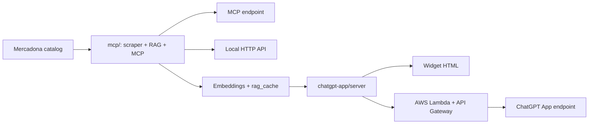

# RecetONA

[](https://github.com/wensicm/RecetONA/actions/workflows/ci.yml)
[](https://github.com/wensicm/RecetONA/blob/main/LICENSE)
[](https://www.python.org/)

RecetONA es un proyecto que extrae, indexa y consulta productos de
Mercadona para generar recetas y listas de la compra sobre tres superficies:

- un backend RAG local para desarrollo y exploración
- un servidor MCP listo para integrarse con clientes compatibles
- una ChatGPT App con widget y despliegue en AWS Lambda

El objetivo del repo no es solo enseñar prompting o un notebook: enseña
scraping, preparación de catálogo, embeddings, MCP, Apps SDK, despliegue
serverless y una separación explícita entre backend operativo y app de
ChatGPT.

Es un proyecto independiente y no afiliado a Mercadona.

## Qué demuestra este repo

- scraping y refresco de catálogo de retail
- indexación RAG con embeddings de OpenAI
- exposición de herramientas vía MCP
- integración completa con ChatGPT Apps y widget HTML
- despliegue en AWS Lambda + API Gateway con custom domain
- validación automática con tests

## Superficies desplegadas

| Superficie | URL | Uso |
| --- | --- | --- |
| ChatGPT App | [https://api.wensicm.com/recetona/app](https://api.wensicm.com/recetona/app) | Endpoint MCP remoto para la app de ChatGPT |
| MCP base | [https://api.wensicm.com/recetona/mcp](https://api.wensicm.com/recetona/mcp) | Backend MCP operativo actual |

## Estructura del repo

El repo está dividido en dos raíces funcionales:

- [`mcp/`](mcp/): implementación operativa actual. Aquí viven el scraper, el
  índice RAG, el servidor MCP, el servidor HTTP local, el frontend demo, los
  tests y el despliegue Lambda del backend base.
- [`chatgpt-app/`](chatgpt-app/): evolución de RecetONA hacia una ChatGPT App
  con separación `server/` + `web/`, widget desacoplado y despliegue propio.

La fuente de verdad funcional está en:

- [`mcp/src/recetona/`](mcp/src/recetona/)
- [`chatgpt-app/server/src/recetona/`](chatgpt-app/server/src/recetona/)

Las carpetas `lambda/` contienen snapshots autocontenidos del runtime para
que `sam build --use-container` sea reproducible sin depender de todo el
workspace. Esa duplicación es deliberada y está documentada en
[`docs/architecture.md`](docs/architecture.md).

## Arquitectura

La explicación técnica completa está en
[`docs/architecture.md`](docs/architecture.md).

Resumen rápido:



## Arranque rápido

### 1. Crear entorno local

```bash
uv venv .venv --python 3.12
uv pip install --python .venv/bin/python \
  -r mcp/requirements.txt \
  -r chatgpt-app/server/requirements.txt
```

### 2. Configurar variables de entorno

```bash
export OPENAI_API_KEY="tu_clave"
```

Si prefieres trabajar con ficheros locales `.env`, créalos manualmente en los
subárboles que uses. El repositorio no incluye plantillas `.env.example`.

### 3. Ejecutar una de las superficies

Backend MCP actual:

```bash
cd mcp
../.venv/bin/python recetona_mcp_server.py --transport stdio
```

ChatGPT App local:

```bash
cd chatgpt-app/server
../../.venv/bin/python recetona_chatgpt_app_server.py --transport streamable-http
```

Más detalle en:

- [`mcp/README.md`](mcp/README.md)
- [`chatgpt-app/README.md`](chatgpt-app/README.md)

## Cómo revisar el repo en 3 minutos

Si vienes como revisor técnico, empieza aquí:

1. [`docs/architecture.md`](docs/architecture.md)
2. [`mcp/src/recetona/mcp_app.py`](mcp/src/recetona/mcp_app.py)
3. [`chatgpt-app/server/src/recetona/mcp_app.py`](chatgpt-app/server/src/recetona/mcp_app.py)
4. [`mcp/tests/`](mcp/tests/)
5. [`chatgpt-app/server/tests/`](chatgpt-app/server/tests/)

## Calidad y CI

El repositorio incluye CI visible en GitHub Actions para:

- instalar dependencias con `uv`
- ejecutar `black -l 79 --check`
- ejecutar `pytest` sobre `mcp/tests` y `chatgpt-app/server/tests`

La definición está en [`.github/workflows/ci.yml`](.github/workflows/ci.yml).

## Estado del proyecto

- `mcp/` es la base operativa actual
- `chatgpt-app/` ya está desplegada y funcional
- el repo sigue siendo un workspace de producto real, no una demo estática

## Contribución

Las normas prácticas de colaboración están en
[`CONTRIBUTING.md`](CONTRIBUTING.md).

## Licencia

Este repositorio se publica bajo licencia [MIT](LICENSE).
