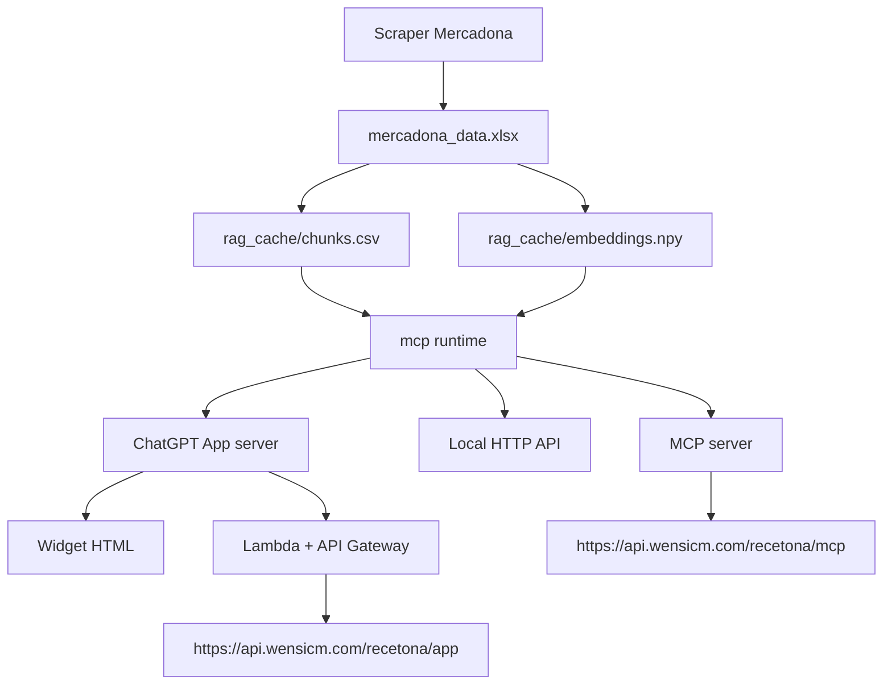

# Arquitectura de RecetONA

## Resumen

RecetONA es un repo con dos superficies funcionales y dos tipos de runtime:

- backend MCP operativo
- ChatGPT App con widget
- ejecución local para desarrollo
- ejecución serverless en AWS Lambda

La clave para entender el repo es esta:

- `mcp/` es la implementación operativa actual del backend
- `chatgpt-app/` es la evolución hacia una experiencia más integrada con
  ChatGPT
- las carpetas `lambda/` son snapshots autocontenidos para build y deploy, no
  la fuente de verdad principal

## Mapa del repo

```text
RecetONA/
├── README.md
├── docs/
│   └── architecture.md
├── mcp/
│   ├── src/recetona/
│   ├── tests/
│   ├── lambda/recetona_mcp_api/
│   ├── local_rag_server.py
│   ├── recetona_mcp_server.py
│   └── mercadona_scraper_script.py
└── chatgpt-app/
    ├── server/
    │   ├── src/recetona/
    │   └── tests/
    ├── web/public/
    └── lambda/recetona_chatgpt_app_api/
```

## Flujo de datos



## Superficies principales

### `mcp/`

Es la base operativa del proyecto.

Contiene:

- scraper de catálogo
- construcción de embeddings y cache RAG
- servidor HTTP local
- servidor MCP
- tests de backend
- despliegue Lambda del MCP base

Fuente de verdad principal:

- `mcp/src/recetona/`
- `mcp/local_rag_server.py`
- `mcp/recetona_mcp_server.py`

### `chatgpt-app/`

Es la capa de integración con ChatGPT Apps.

Contiene:

- `server/`: runtime MCP + tool handlers de la app
- `web/public/`: widget HTML que renderiza la receta
- `lambda/`: snapshot autocontenido para SAM

Fuente de verdad principal:

- `chatgpt-app/server/src/recetona/`
- `chatgpt-app/server/local_rag_server.py`
- `chatgpt-app/web/public/recetona-widget.html`

## Por qué hay duplicación en `lambda/`

Esto es lo primero que un revisor técnico suele cuestionar, así que conviene
dejarlo explícito.

Las carpetas:

- `mcp/lambda/recetona_mcp_api/`
- `chatgpt-app/lambda/recetona_chatgpt_app_api/`

no son la fuente de verdad del producto. Son snapshots autocontenidos para:

- `sam build --use-container`
- empaquetado reproducible
- despliegue de Lambda sin depender del resto del workspace

El patrón aquí es pragmático:

- fuente de verdad para desarrollo: `mcp/` y `chatgpt-app/server/`
- snapshot de despliegue: `*/lambda/*`

## Cómo revisar el código con criterio

Si quieres entender la lógica principal, este orden da el máximo contexto con
el mínimo tiempo:

1. `README.md`
2. `mcp/src/recetona/mcp_app.py`
3. `mcp/local_rag_server.py`
4. `chatgpt-app/server/src/recetona/mcp_app.py`
5. `chatgpt-app/web/public/recetona-widget.html`
6. `mcp/tests/`
7. `chatgpt-app/server/tests/`

## Despliegue

### MCP base

- endpoint esperado: `https://api.wensicm.com/recetona/mcp`
- infraestructura en `mcp/lambda/recetona_mcp_api/`

### ChatGPT App

- endpoint esperado: `https://api.wensicm.com/recetona/app`
- infraestructura en `chatgpt-app/lambda/recetona_chatgpt_app_api/`

## Posibles evoluciones futuras

Si se quisiera llevar el repo a una estructura aún más limpia, la dirección
natural sería:

```text
packages/recetona/
services/mcp/
apps/chatgpt-app/
deploy/aws/
```

No se ha hecho todavía para no introducir una migración física agresiva
mientras el producto sigue evolucionando y desplegándose.
